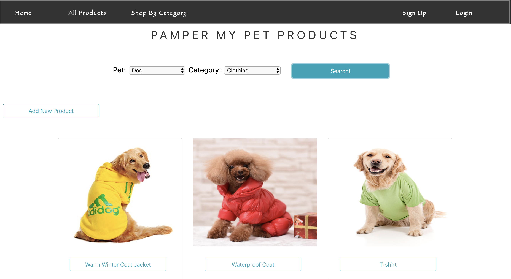
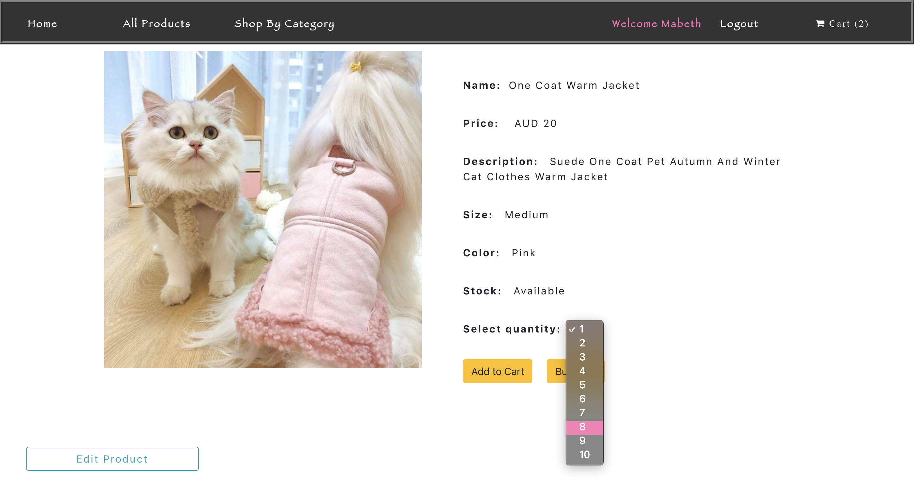
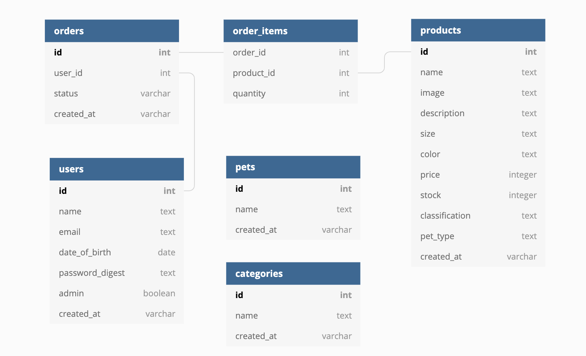

# Pamper My Pet

With the huge variety of pet-oriented content on the web, this "best of" list should give you a better idea of where to find anything from trendy haute couture pet creations to the lowest prices on dog, cat, bird and fish products. **Happy Shopping!**

Shop here: [Pamper My Pet](https://mmborres.github.io/pamper-my-pet)

Simply anyone can view our site and browse through the amazing range of products. However, in order to purchase a product, a new ***User*** has to *Create* and account and an existing one has to *Login*

### Login Page

### Sign Up Page

### Nav Bar Dropdown to Search Products

*Users* can find their favourite product by filtering either through the ***Navbar Dropdown*** or can visit the ***All Products*** pgae and can filter through the search form.

### Item Page

*Users* may select the quantity of each Product from the dropdown option of the page. The options are dependent on the the availibility of the stock of that particular item.

As you can see here, User can select upto 10 **Quantity** of this particular product which means there are only 10 in **Stock**

Users then can add products in their **Cart** and once they are done filling their Cart, they can click the Cart Icon in Navbar that will redirect them to the Purchasing Process page or they can click directly on **Buy Now** that will redirect the User to the Purchasing Process page.

### Checkout Page

After clicking *Buy Now* button or *Cart Icon* in Navbar. The User can view the **Order Details**. He may **Edit** the quantity of an item or can also **Remove** the product from the buttons provided according to his convenience.

### Card Payment

Our secure payment method, allows the User to make Payment wit ease.

### Payment Done

Technologies
-----------------------------------------------------
This E-Commerce web application uses mainly **ReactJS** Front-end and **Rails** Back-end with **PostgreSQL** as database and has been deployed on **Heroku**.

***Pamper My Pet*** has the following MVC (Model View Controller) Structure

Each **Model** inherits from *ActiveRecord* that does the following in an object oriented fashion:

* Create tables
* Represent associations between Models
* Perform database operations

-----------------------------------------------------
- Front-end uses HTML utilising Google Fonts and web-sourced images.
- Styling and animations through CSS, Bootstrap and Favicons
- ReactJS for Front-end Components

#### Major Features:

  * Rails API: JSON endpoint rendering in the Controllers
     * JWT for User Authentication  
     * Stripe API for simulated payments      
  * Windows LocalStorage used in handling Session Data
    * Storing session for current user
    * Storing cart items
  * NPM Packages Applied: Alice Carousel for the Carousel Display in the Home Page, React-Stripe-Elements for the Card Payment
  * `Axios.get` `Axios.post` `Axios.put` Method will save the User's Cart in the database if he Logs Out without Purchasing them. Later, if she/he Logins even from some other device, he will be able to view the Cart
  * Gems: BCrypt, JWT, Stripe and Rack-Cors to enable API Endpoint
  * Admin Rights

  

  

Wishlist
----------------------------------------------------

  * Implement Discount or Sale options
  * Simulate Delivery System
  * Introduce User Review for *Pamper My Pet* Products
  * Enable Price Filter in Search Bar.
  * More Animations
